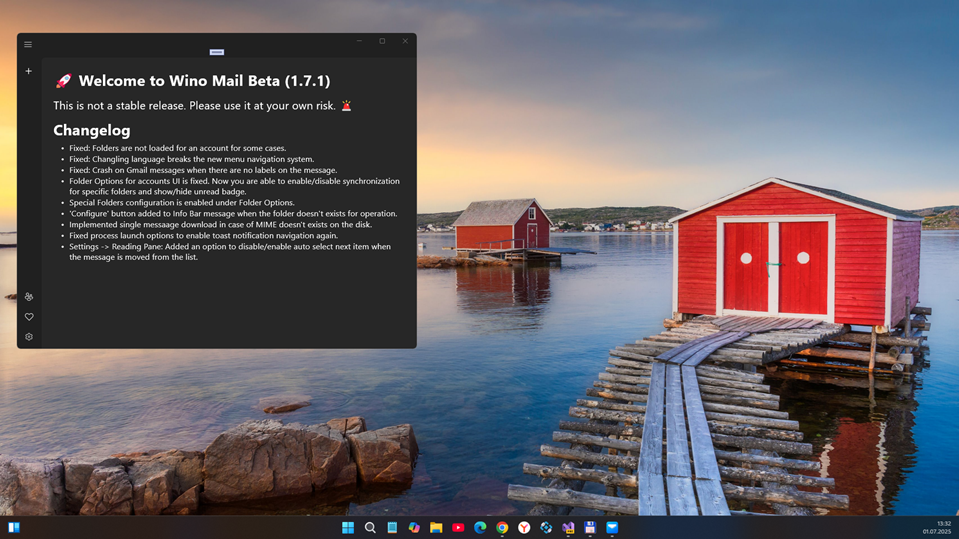
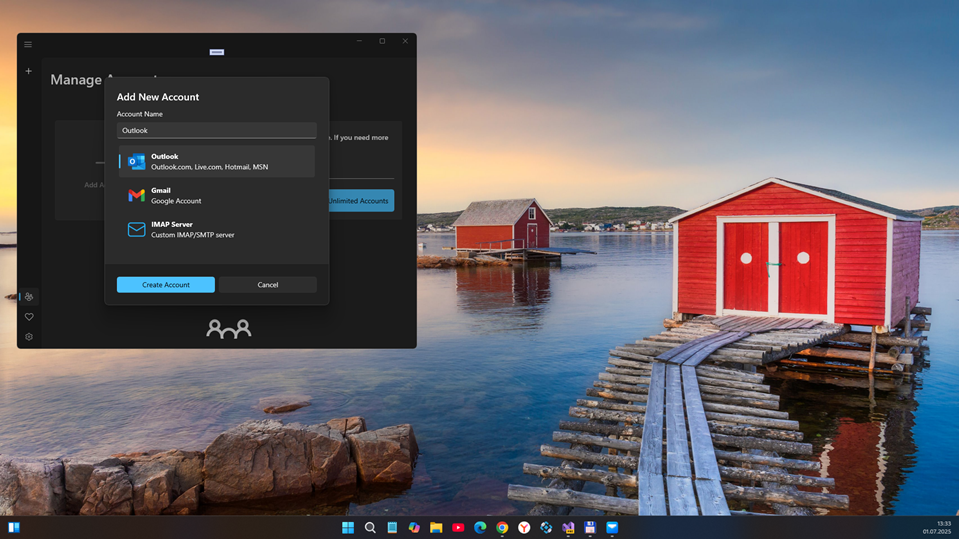
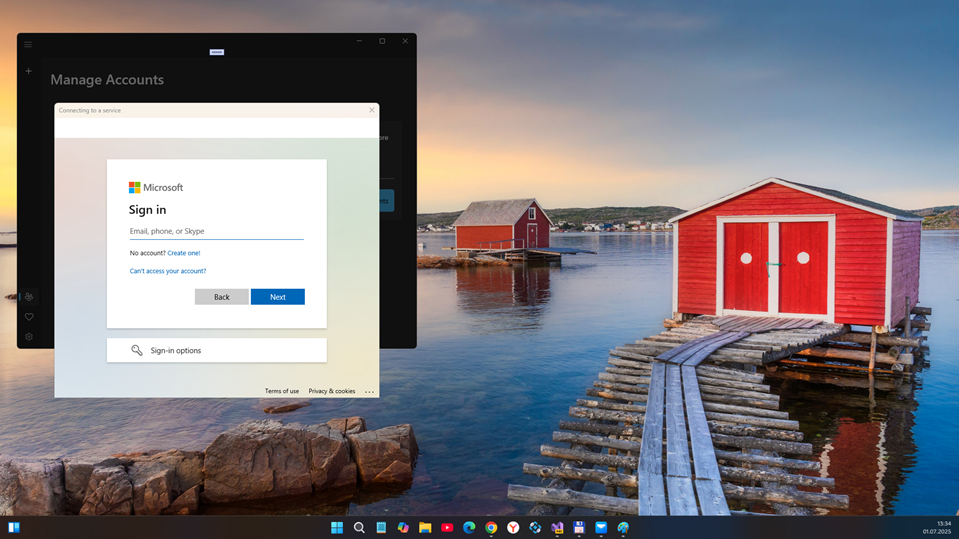
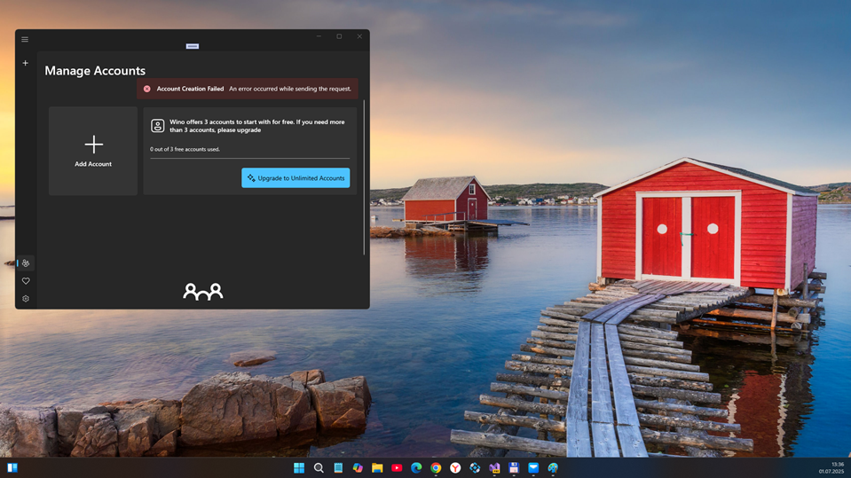
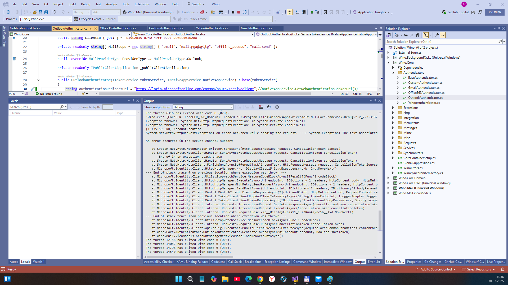
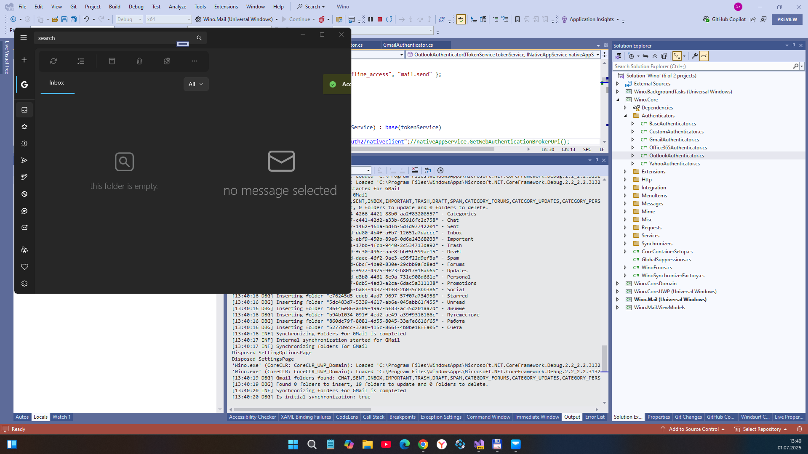
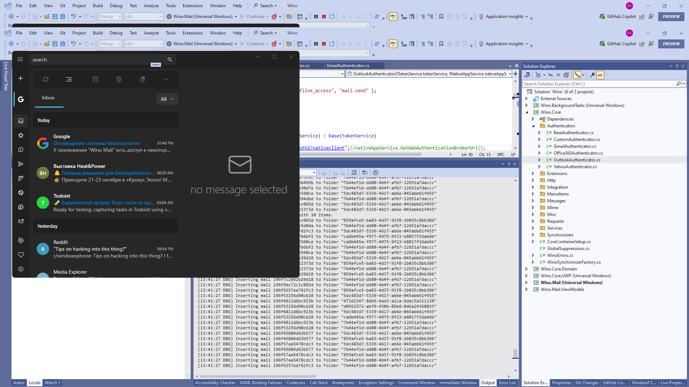
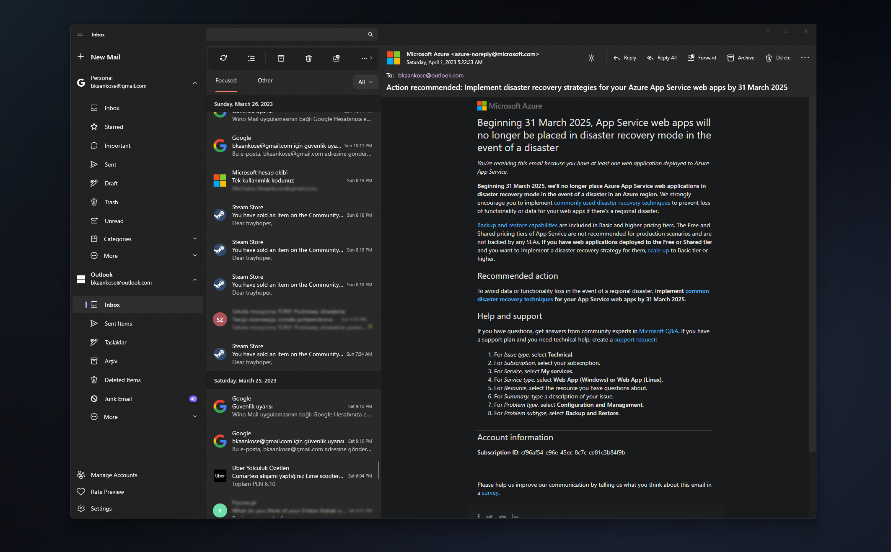

# Wino-Mail - retro branch 

My little RnD of Burak Kaan Köse's [AllInOneApp](https://github.com/bkaankose/Wino-Mail) uwp app (v1.7.1).

## Screenshot(s)

## Progress / Status
- Tested Outlook & GMail accaunts adding feature (Outlook - failed, GMail - ok...)
- Work-in-progress (Experimenting with .NET 2 & UAP 17763)

## Problems
- Adding Outlook account failed  

## TODO
- Explore more things about Microsoft Graph "framwork" / api
- Try to fix Outlook accaunt adding & normal email getting...

## References
 - Repo URL (original project): https://github.com/bkaankose/Wino-Mail
-  Developer (original project): [Burak Kaan Köse](https://github.com/bkaankose/)

## ..
AS IS. No support. RnD only. DIY.

## .
- [M][E] July, 1 2025

